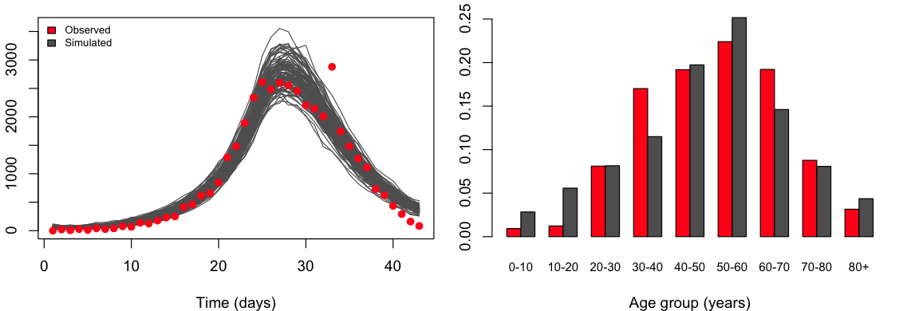

# Age-structured model for COVID-19 transmisison
Renata Retkute (rr614@cam.ac.uk) and Christopher Aidan Gilligan

Department of Plant Sciences, University of Cambridge, Downing Street, Cambridge
CB2 3EA, UK

This is an adaptation of stochastic age-structured model from Minter and Retkute 2019, Epidemics 29, 100368, "Approximate Bayesian Computation for infectious disease modelling" https://doi.org/10.1016/j.epidem.2019.100368

Parameter are estimated using the ABC-SMC algorithm with tolerance calculated as the median from the previous generation.

Outbreak data is the COVID-19 epidemic in Hubei province in China as curated @: https://github.com/jriou/covid_adjusted_cfr

Contact pattern from: Prem, Cook and Jit 2017, PLoS     Comput     Biol 123, "Projecting social contact matrices in 152 countries using contact surveys and demographic data",  https://doi.org/10.1371/journal.pcbi.1005697

Figure 1. Comparing observed outbreak data with model simulations: number of daily cases (left) and percentage of cases in different age groups (right).

